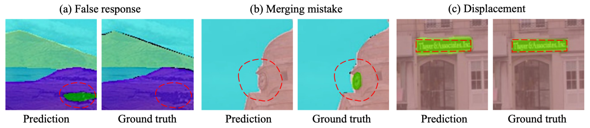

# ICLR2024 When Semantic Segmentation Meets Frequency Aliasing

The implementation  of our ICLR 2024 paper "[WHEN SEMANTIC SEGMENTATION MEETS FREQUENCY ALIASING](https://openreview.net/forum?id=SYBdkHcXXK)".

Interested readers are also referred to an insightful [Note](https://zhuanlan.zhihu.com/p/678596052) about this work in Zhihu. 

**Abstract**

Despite recent advancements in semantic segmentation, where and what pixels are hard to segment remains largely unexplored. Existing research only separates an image into easy and hard regions and empirically observes the latter are associated with object boundaries.  In this paper, we conduct a comprehensive analysis of hard pixel errors, categorizing them into three types: false responses, merging mistakes, and displacements.  Our findings reveal a quantitative association between hard pixels and aliasing,  which is distortion caused by the overlapping of frequency components in the Fourier domain during downsampling. To identify the frequencies responsible for aliasing, we propose using the equivalent sampling rate to calculate the Nyquist frequency, which marks the threshold for aliasing.  Then, we introduce the aliasing score as a metric to quantify the extent of aliasing. While positively correlated with the proposed aliasing score, three types of hard pixels exhibit different patterns. Here, we propose two novel de-aliasing filter (DAF) and frequency mixing (FreqMix) modules to alleviate aliasing degradation by accurately removing or adjusting frequencies higher than the Nyquist frequency. The DAF precisely removes the frequencies responsible for aliasing before downsampling,  while the FreqMix dynamically selects high-frequency components within the encoder block. Experimental results demonstrate consistent improvements in semantic segmentation and low-light instance segmentation tasks.


## Highlight✨

- Going beyond the binary distinction of easy and hard regions, we categorize pixels challenging for segmentation into three types: false responses, merging mistake, and displacements. These three error types hold varying levels of significance in different tasks.
- We introduce the concept of equivalent sampling rate for the Nyquist frequency calculation and propose an aliasing score for quantitative measurement of aliasing levels. Our metric effectively characterizes the three types of errors with distinct patterns. 
- We design a simple de-aliasing filter to precisely remove aliasing as measured by our aliasing score. Additionally, we propose a novel frequency-mixing module to dynamically select and utilize both low and high-frequency information. These modules can be easily integrated into off-the-shelf semantic segmentation architectures and effectively reduce three types of errors. Experiments demonstrate consistent improvements over state-of-the-art methods in standard semantic segmentation tasks and low-light instance segmentation.



Illustration of three boundary error types.

## Code Usage

### Installation

Our code is based on [MMSegmentation](https://github.com/open-mmlab/mmsegmentation).

Please refer to [get_started.md](https://github.com/open-mmlab/mmsegmentation/blob/main/docs/en/get_started.md#installation) for installation and [dataset_prepare.md](https://github.com/open-mmlab/mmsegmentation/blob/main/docs/en/user_guides/2_dataset_prepare.md#prepare-datasets) for dataset preparation.

You can install mmcv-full by: 

```
pip install torch==1.11.0+cu113 torchvision==0.12.0+cu113 -f https://download.pytorch.org/whl/torch_stable.html
pip install mmcv-full==1.5.3 -f https://download.openmmlab.com/mmcv/dist/cu113/torch1.11/index.html
```

### Results

Results are reported on Cityscape val set.

You can obtain detailed results by:

```
python ~/SegAliasing/test.py \

~/configs/upernet_r50-d32_cityscapes.py \

~checkpoint.pth --eval mIoU
```

| Method                         | mIoU↑    | BIoU↑    | BAcc↑    | FErr↓    | MErr↓    | DErr↓    |
| ------------------------------ | -------- | -------- | -------- | -------- | -------- | -------- |
| UPerNet-R50 (Baseline)         | 78.1     | 61.8     | 74.4     | 27.2     | 25.1     | 26.9     |
| $\frac{1}{4}\times1.0$         | 78.6     | 62       | 74.9     | 26.7     | 24.8     | 26.7     |
| $\frac{1}{4}\times1.1$         | 78.7     | 62.3     | 75.4     | 26.7     | 24.2     | 26.1     |
| $\frac{1}{4}\times1.2$         | 78.8     | 62.4     | 75.4     | 26.3     | 24.3     | 26.2     |
| $\frac{1}{4}\times1.3$         | 79.2     | 62.4     | 75.4     | 26.2     | 24.3     | 26.1     |
| **$\frac{1}{4}\times \sqrt2$** | **79.3** | **62.6** | **75.7** | **26.0** | **24.0** | **25.9** |
| $\frac{1}{4}\times1.5$         | 78.9     | 62.4     | 75.0     | 26.6     | 24.6     | 26.4     |
| $\frac{1}{4}\times1.6$         | 79.1     | 62.1     | 75.2     | 26.7     | 24.5     | 26.5     |


| PASCAL VOC 2012        | mIoU↑ | BIoU↑ | BAcc↑ | FErr↓ | MErr↓ | DErr↓ |
| ---------------------- | ----- | ----- | ----- | ----- | ----- | ----- |
| UPerNet-R50 (Baseline) | 74.3  | 61.0  | 73.4  | 27.8  | 24.9  | 24.5  |
| Ours                   | 76.1  | 62.7  | 74.9  | 26.0  | 24.0  | 23.6  |

| ADE20k   | mIoU↑ | BIoU↑ | BAcc↑ | FErr↓ | MErr↓ | DErr↓ |
| -------- | ----- | ----- | ----- | ----- | ----- | ----- |
| Baseline | 38.87 | 29.5  | 40.5  | 60.4  | 58.9  | 60.2  |
| Ours     | 40.35 | 31.2  | 43.3  | 57.9  | 55.6  | 56.7  |

## Citation

If you use our dataset or code for research, please cite this paper and related work: 

```
@inproceedings{chen2024semantic,
  title={When Semantic Segmentation Meets Frequency Aliasing},
  author={Chen, Linwei and Gu, Lin and Fu, Ying},
  booktitle={International Conference on Learning Representations},
  year={2024}
}
```

```
@article{2023lis,
  title={Instance Segmentation in the Dark},
  author={Chen, Linwei and Fu, Ying and Wei, Kaixuan and Zheng, Dezhi and Heide, Felix},
  journal={International Journal of Computer Vision},
  volume={131},
  number={8},
  pages={2198--2218},
  year={2023},
  publisher={Springer}
}
```


## Contact

If you find any problem, please feel free to contact me (Linwei at  chenlinwei@bit.edu.cn). A brief self-introduction (including your name, affiliation, and position) is required, if you would like to get in-depth help from me. I'd be glad to talk with you if more information (e.g. your personal website link) is attached.